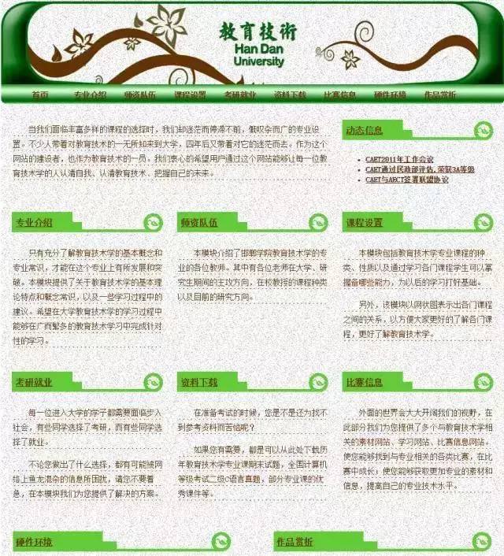

web前端工程师。

####　ｗｅｂ

网站：多个网页组合起来形成一个网站。

万维网：多个网络站点和网页的集合（`world wide web`），也简称3W、www、web。


#### 前端


互联网发展过程中，前端和后端好比是电视和电视塔的关系。

后端就像电视塔（用来发送数据），前端就想电视机用来显示发送过来的数据。


#### 前端的重要性

* 最初的网站（89年左右，最初的web界面）

    

* 2000年左右

    

* 2010年左右

    

    颜值时代，好看就是正义（不代表个人观点）？？？

    好看  易用性  功能性

#### 域名&URL地址

在有网（有网线或无线）的前提下访问网络要靠什么来访问。

访问网络主要靠IP地址。

14.215.177.39，就是所谓的IP地址。

IP地址分为2大类IPV4、IPV6。IPV4现在还是主流。

IPV4的IP地址的格式：4组，每一组之间使用逗号进行分隔。每一组之间的数是从0~255。0、1、255。

IP地址不便于记忆，所以有了域名和DNS。

* 域名（Domain Name），简称域名。

    域名总共3部分组成，每一部分都使用`点号`来进行分隔。

    `www.baidu.com`

    * 顶级域名

        * com，商业机构
        * net，网络组织
        * org，非盈利组织
        * cn，中国
        * hk，香港
        * tech，学习

        顶级域名（已经规定好的）需要我们自己花钱购买（买也不能买下全部的）。

        `360buy.com`

    * 二级域名

        是我们可以自己花钱注册的。

        baidu.com（已被别人购买了）

        baidu.net（没有被购买）

    * 主机名

        指的是在你这个二级域里面的一台一台的主机。

        这个主机名是我可以自己决定叫什么的，不用再花钱。

        `www.baidu.com`叫www没有什么硬性规定，惯例。

        `www.xxx.com`

        `www.baidu.com`，我现在访问的是一个商业机构的网站，这个网站baidu，我现在访问的是baidu这个商业机构网站里面叫www的这台主机。

    

* DNS（网域名称系统，`Domain Name System`），将域名和IP地址相互映射的一种服务。

* URL

    `www.baidu.com`叫URL地址（统一资源定位符），它用来表示要请求的资源的具体地址。

    `http://www.ceshi.com:80/test/test.html?par1=var1&par2=var2#xxx`

    * http，协议名。告诉通信的双方(服务器端和客户端)用什么约定来进行通信。

        http，https

        一般浏览器会自带协议。

        `https://www.baidu.com/`

        `http://127.0.0.1/`

        https是http的升级版本。

        可选的

    * `www.ceshi.com`，服务器地址。要请求哪个服务器（它的地址是多少）。

    * `:80`，端口号。默认值

        根据协议的不同也会有不同的端口号。

        http协议默认端口号是80

        https协议默认端口号是443

        端口号是从0~65535。

        端口号有没有可能重复。

    * `/test/test.html`指的是要访问的文件路径。默认可选的。

        `http://www.ceshi.com:80/test/test.html`

        `http://127.0.0.1/test/test.html`

        我要通过`http协议`访问www.ceshi.com这台服务器（通过80端口），我要访问这台服务器上的__网站根目录__下面的test目录下面的`test.html文件`。

        当你访问服务器的时候我为了安全，不能让你访问到服务器上所有的文件。但是我可以让你访问一个特殊的目录（这个目录是我想让你访问的）。

    * `par1=var1&par2=var2`，查询字符串。用来给后端服务器端脚本语言传值用的。

        格式：`名字=值`

        可以有多组，多组之间使用`&`符进行分隔，可以有多组。

        `名字=值&名字=值.......`

        名字和值是都是我们前端和后端一起约定好的。

        ```css
        ie=utf-8
        &
        f=8
        &
        rsv_bp=1
        &
        rsv_idx=1
        &
        tn=baidu
        &
        wd=xiaoshuaige
        &
        fenlei=256
        ```

        叫wd的这个名字所对应的值就是用户要查询的关键字。

        叫fenlei的这个名字所对应的值就是分类的值。

    * `#xxx`，片段标识符。用来获得一个大资源中的小资源。（暂时先不管，明天的时候就知道了）

    #### 网络软件组成（web的组成）

    * 什么是客户端，什么是服务器端。

        * 客户端，用来发起请求，接收服务器端发来的消息的一方。在web中指的就是浏览器。
        * 服务器端，用来接收客户端发来的请求，并且给出回应。

    * 网站的组成

        * 客户端-浏览器，是www服务器的客户端，向www服务器发送各种请求，对服务器发来的网页进行解释，并且让用户和这些文件进行交互。

        * HTML（超文本标记语言）

            网页的本质就是超文本标记语言。他用来将网页中的各个部分标记出来，让浏览器进行解释。

        * CSS（层叠样式表）

            单纯的使用HTML进行标记出来的内容比较混乱，不美观。CSS用来将HTML标记出来的内容进行合理的摆放、进行美化。

            毛坯房----》装修

            灵性  不会动。

        * 客户端脚本语言（JavaScript）

            * 脚本：一种程序，不能独立运行，需要一个载体来运行它。
            * 客户端：在我们这里客户端指的就是浏览器。
            * 客户端脚本语言：在浏览器上运行的脚本语言。

            HTML、CSS、JavaScript的关系：html用来标记、CSS用来美化、JavaScript用来交互。

            有了HTML、CSS、JavaScript之后需要放到网络上让别人能够访问到。

        * web服务器

            也称为www服务器，通常的我们所说的web服务器是一种软件。能够提供网络访问的一种软件。

            用来接收客户端发来的请求，将响应给到客户端。

            常用的服务器：IIS、Apache、Nginx

            

            __我们的HTML、CSS、JavaScript代码是由客户端来就行解释的，由web服务器返回的。__

            所有的内容都需要经过网络来访问。

            我们前端工程师最主要学习HTML、CSS、JavaScript。Vue、React。

            HTML、CSS、JavaScript。。。。。。  Vue、React框架。

            

            

        * 服务器端脚本语言

            在服务器上运行的脚本语言。（后端脚本语言）

            Java、Python、PHP

        * 数据库

            放置数据的仓库。

            Oracle、MySQL、Access。

    

    ####　浏览器

    浏览器是网页运行的平台，常见的浏览器有 IE 、火狐（Firefox）,谷歌（Chrome）,Safari和Opera等，我们平时称为五大浏览器，第六个是Edge浏览器，是微软改进IE新出的内置浏览器

    因为内核的不同才导致有了所谓的5大浏览器。

    

    

    

    所谓的内核就是指的渲染引擎，负责对网页语法的解释（如标准通用标记语言下的一个应用HTML、CSS）并渲染（显示）网页。 所以，通常所谓的浏览器内核也就是浏览器所采用的渲染引擎，渲染引擎决定了浏览器如何显示网页的内容以及页面的格式信息。

    不同的浏览器内核对网页编写语法的解释也有不同，因此同一网页在不同的内核的浏览器里的渲染（显示）效果也可能不同，这也是网页编写者需要在不同内核的浏览器中测试网页显示效果的原因。 __但它们都需要遵循W3C的标准（HTML5、CSS3、ES标准等等），所以浏览器和浏览器之间会有一些差别，但是差别不大。__

    * IE IE是Trident内核。Window发布后，windows10发布以后IE将其内置浏览器命名为Edge,Edge最显著的特点就是新内核EdgeHTML。

    * Firefox(火狐) Gecko内核，Gecko的特点是代码完全公开，因此开发程度很高，全世界的程序员都可以为其编写代码，增加功能，可惜这几年没落了，比如打开速度慢，升级频繁，猪一样的队友flash，神一样的对手chrome。

    * Safari 采用的是大名鼎鼎的WebKit。 现在很多人错误的把webkit叫做chrome（即使chrome内核已经是blink，之前采用的是webkit内核）。

    * chrome(谷歌) Blink内核,在Chromium项目中研发Blink内核渲染引擎（即浏览器核心），内置于Chrome浏览器之中，Blink其实是Webkit的分支，大部分国产浏览器最新版用Blink内核

    * Opera Presto内核(已经废弃)是挪威产浏览器opera的“前任”内核，为何说是“前任”，因为最新的opera浏览器早已抛弃投入到谷歌的怀抱了，采用Blink。

    * 其他国产浏览器都是在国外浏览器的内核的基础上加上了自己的UI壳子，就成了自己的浏览器了。

    __计算机是傻子。__

#### 什么是HTML（超文本标记语言）

文本标记语言：用标记将文本标识出来的语言。

超：比普通的文本标记语言多了一些东西，比如图片、视频等等。

`Hyper Text Mark-up Language`，通过标记将网页中的各个部分标记出来，HTML是一种标准是一种规范。


#### HTML的发展史

1. 是在91年一个叫tim-Lee的写了一份名为HTML的文档，在文档里面他用20多个标记将文字进行标记。这就是传说中的1.0。

2. 最早的HTML的官方规范是由IETF（因特网工程任务组）发布的HTML2.0，实际上不存在HTML1.0

3. 继IETF之后，W3C（万维网联盟），成为了HTMl后续的标准制定者。90年代中期以后，W3C对HTMl进行了几次升级，直到1999年发布的HTMl4.01

4. HTMl4.01后的修订版为xhtml1.0（x的意思为可扩展的），实际上XHTML1.0规范内容与HTML4.01完全相同，没有添加任何新元素或新属性，这两个规范的唯一的差别是对HTML语法作出了不同的规定，HTMl为开发人员提供了很大的自由度，可以按照自己的意愿去编写元素和属性，但XHTML要求开发人员遵从XML规则，XHTML1.0规则要求比较严格，要求所有标签和属性都必须为小写。

5. 之后为了更加规范，W3C发布了xhtml1.1，但是很多浏览器厂商不配合不检查xhtml的规范

6. W3C开始着手开发XHTML2，但是XHTML2与所有的网页内容都不兼容，甚至于以前版本的HTML也不兼容。

7. 这时有一些人开始反对XHML2.0尤其是来自opera、apple、moailla的代表，它们希望支持以前的版本并开发一些新功能，但是被驳回。

8. 之后他们创建了WHATWG组织，开始开发一些规范，就是HTML5的前身，之后因为XHTML2.0的推进速度不快，人们又不愿意使用。所以W3C开始和WHATWG组织协商接受HTMl5。

9. 2014年10月28日，HTML 5.0，W3C正式发布HTML 5.0推荐标准

HTML5兼容以前的东西，并且加入了新的功能。

`HTML4-》CSS2-》HTML5-》CSS3`

####  编辑器的调试

__在一个目录中使用右键，通过code打开。__一定要在一个目录中打开。


Chinese (Simplified) Language Pack for Visual Studio Code （中文语言包）
Path Intellisense 路径的
Open In Default Browser 服务器的
Live Server 服务器的


1. 先在扩展的搜索选项中进行搜索。

2. 搜索出来的第一个就是你要安装的。

3. 点击Install安装指定的插件。

    


#### HTML基础语法 

1. 在目录中创建一个文本文件，改名为`1.html`

    起名的内容不要用中文。

    

2. 书写HTML内容

    关于文件是否保存：显示叉号表示文件已经保存了。

    

    如果显示的是黑色的小点点，说明文件已经发生更改但是没有保存。

    

3. 右键在浏览器中打开。

    

    `http://localhost:52330/1.html`（经过网络通过服务器打开。）

    `file:///C:/xampp/htdocs/0731/1/1.html`（走的是本地的file协议，没有经过服务器）

4. 对文本进行标记

    `<marquee></marquee>`叫标签。他是HTML最基本的单位，也是最重要的组成部分。

    标签需要用两个尖括号包起来，中间包含指定的字母。`<marquee>`要注意中间所包含的字母是已经定义好的。

    `<标签名>标记出来的内容</标签名>`这种叫双标签，标签有两个标记一个代表开始，一个代表结束。结束的标签后面使用`/`来结尾。开始标签和结束标签标签名都是相同的，成对的出现的。

    `<标签名 />`，这种叫单标签，不是成对出现的。结尾的时候以`/`来结尾。（结尾的正斜线可加可不加）

    `<br />`表示的是换行，这个就是个单标签。

    注意：HTML标签不区分大小写，但是我们推荐使用小写。

5. 使用属性控制、调整标签

    ```html
    <marquee loop="1">hello world！</marquee>
    ```

    `loop="3"`，叫属性，用来修饰、控制标签。

    格式：`属性名="属性值"`

    注意：

    1. 属性要写在标签里面。
    2. 写属性值的时候可以使用单引号、双引号所包裹。甚至可以不写引号。但是建议使用双引号包裹。

    属性可以有多个，标签的属性不区分先后。

    `<marquee bgcolor="颜色值"></marquee>`

6. HTML中颜色的表示

    * 直接使用颜色的单词来表示颜色。

        pink、blue、red、green......

    * 用6位的16进制的值来表示（0~9、a~f）

        6位十六进制的值，将6位分别分成三组（每两位一组）分别代表红、绿、蓝。在表示颜色的时候需要前面加上`#`号。

        

7. HTML对于空格和回车的处理

    __在HTML中一个空格和多个空格，一个回车和多个回车都会被当作一个空格来处理。__

    多个回车我可以使用`<br />`

    多个空格我们需要使用实体来解决。

    实体：用一些特殊的数字、字符来表示一些特殊字符的字符串。

    格式：`&字母;`

    * 空格： `&nbsp;`
    * `<`：`&lt;`
    * `>`：`&gt;`
    * `&`：`&amp;`
    * `"`：`&quot;`
    * `'`：`&apos;`

    `<marquee>`这个标签是什么意思？

8. 标签嵌套

    `<MARQUEE>hello<br/>world！</MARQUEE>`

    双标签里面可以嵌套：可以嵌套双标签也可以嵌套单标签。

    __注意：__ 在写标签嵌套的时候要有缩进，在代码里面表示出来标签的父子关系。

    ```css
    <标签1>
        <标签2></标签名2>
    </标签名1>
    ```

9. HTML标签的格式： 

    * `<标签名 属性1="值1" 属性2="值2".....>要标记出来的内容</标签名>`
    * `<标签名 属性1="值1" 属性2="值2"......./>`

10. HTML的注释符

    注释符的作用：

    1. 说明代码意思的时候。
    2. 调试代码的时候

    ```html
    <!-- 要注释掉的内容 -->
    ```

    注释符的快捷键：`shift+alt+a`或`ctrl+/`


#### HTML的文档结构

1. 告诉浏览器应该用什么方式解释这个文档。

    在HTML5中使用`<!DOCTYPE html>`来告知浏览器以HTML5的方式来进行解释。

    1. 必须放在第一行。

    2. 不区分大小写。

        1. `<!DOCTYPE HTML>`
        2. `<!doctype html>`
        3. `<!DOCTYPE html>`

        `document type`

        HTML4.01的时候文档头不是这样写： 

        * `<!DOCTYPE HTML PUBLIC "-//W3C//DTD HTML 4.01//EN" "http://www.w3.org/TR/html4/strict.dtd">`
        * `<!DOCTYPE HTML PUBLIC "-//W3C//DTD HTML 4.01 Transitional//EN" "http://www.w3.org/TR/html4/loose.dtd">`
        * `<!DOCTYPE HTML PUBLIC "-//W3C//DTD HTML 4.01 Frameset//EN" "http://www.w3.org/TR/html4/frameset.dtd">`

2. HTML文档的最外层要有一组`<html>`标签，它是唯一的，是网页文件的最外层标签。

    1. 开始的`<html>`表示整个HTML文档的开始。
    2. 结束的`<html>`表示整个HTML文档的结束。
    3. HTML文档中的所有标签都应该放在`<html></html>`中。

3. 在html标签中要有head标签和body标签。

    * `<head>`标签：头标签，这里面的内容不会显示在浏览器中。这里面的内容包含了对当前HTML文档的描述性语句。
    * `<body>`标签：主体标签，里面放置的是网页中真正显示出来的内容。

    在书写HTML文档的时候即使不使用html、head、body标签在运行的时候浏览器也会自动加上。但是为了你书写的标准还是要加上这些。

#### `<head>`标签中的内容

1. `<title>`标签：定义在整个HTML文档的标题，显示在网页的标题栏上，一个HTML文档中应该只有一个title标签。

    显示网页的标题，让用户一看就知道网页要表达的意思。

    

    当在收藏本网页的时候，网页的标题会作为默认的内容存在。

    搜索引擎也会用到title中的内容。网站在使用title标签时候的格式： `文章标题-栏目标题-网站名`或`文章标题|栏目标题|网站名`

    中文博大精深。。。  中文分词。。。